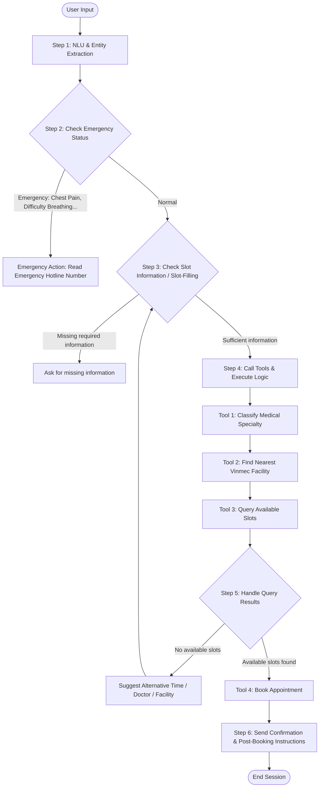

```mermaid
graph TD
Start([User Input]) --> Step1[Step 1: NLU & Entity Extraction]
Step1 --> Step2{Step 2: Check Emergency Status}

    Step2 -->|Emergency: Chest Pain, Difficulty Breathing...| Emergency[Emergency Action: Read Emergency Hotline Number]
    Step2 -->|Normal| Step3{Step 3: Check Slot Information / Slot-Filling}

    Step3 -->|Missing required information| AskMissing[Ask for missing information]
    Step3 -->|Sufficient information| Step4[Step 4: Call Tools & Execute Logic]

    Step4 --> Tool1[Tool 1: Classify Medical Specialty]
    Tool1 --> Tool2[Tool 2: Find Nearest Vinmec Facility]
    Tool2 --> Tool3[Tool 3: Query Available Slots]

    Tool3 --> Step5{Step 5: Handle Query Results}
    Step5 -->|No available slots| Alternate[Suggest Alternative Time / Doctor / Facility]
    Step5 -->|Available slots found| Tool4[Tool 4: Book Appointment]

    Alternate --> Step3
    Tool4 --> Step6[Step 6: Send Confirmation & Post-Booking Instructions]
    Step6 --> End([End Session])
```
